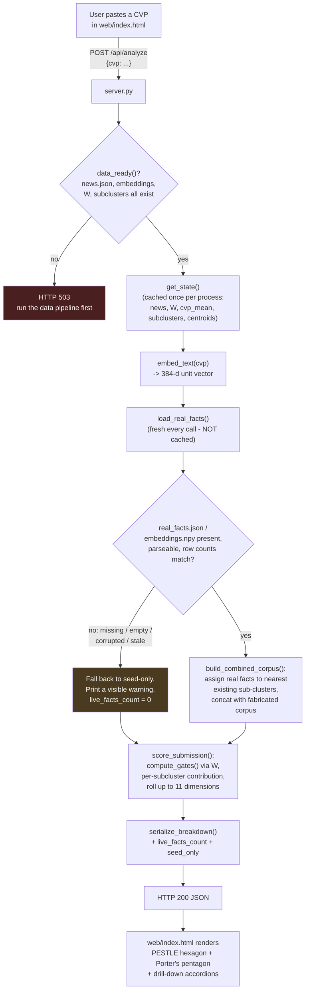
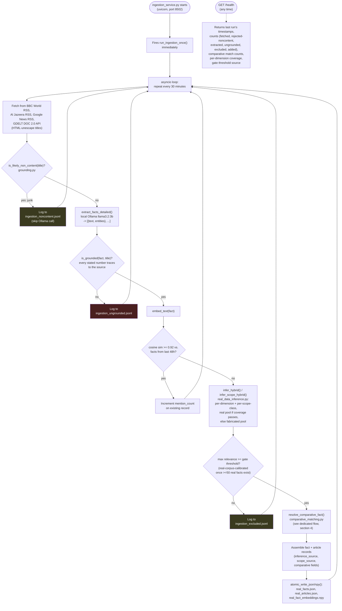
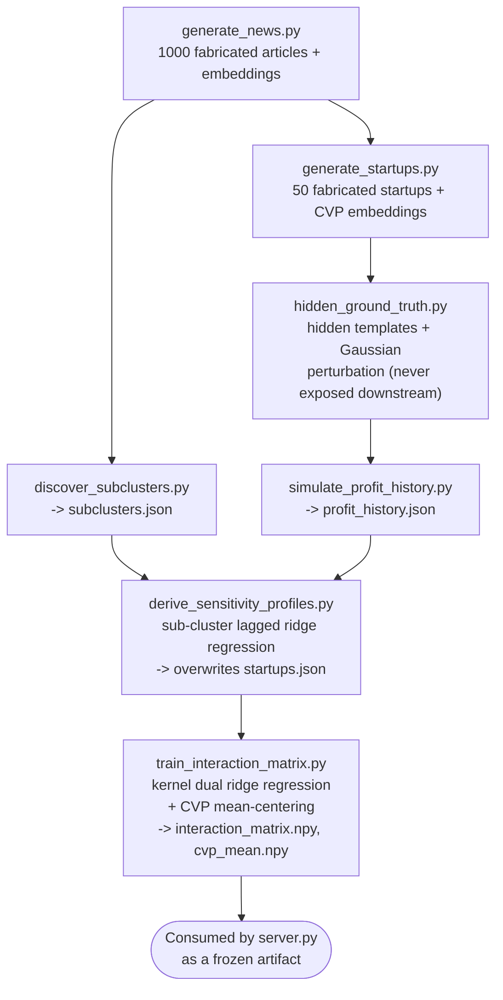

# AI-Based Explainable Market Intelligence — Complete Codebase Architecture & Code Walkthrough

This document describes the system **as it actually runs today**, not as originally designed — including what's finished, what's partially migrated, and what's still a known limitation. It was fully regenerated from the live codebase and current data on disk, not incrementally patched, after the previous version drifted meaningfully out of date (it still described 20 startups, a single fabricated-only inference path, a Streamlit `app.py` that no longer exists, and predated the grounding safeguards, comparative-fact matching, and the real-data migration entirely). A historical GDELT bulk backfill subsystem described in earlier versions has since been removed outright — see CLAUDE.md for that decision and its reasoning.

---

## Table of Contents
1. [System Overview — Three Independent Processes](#1-system-overview--three-independent-processes)
2. [Current Integration Status — Stated Plainly](#2-current-integration-status--stated-plainly)
3. [End-to-End Fact Journey — One Real Fact's Full Path](#3-end-to-end-fact-journey--one-real-facts-full-path)
4. [Comparative-Fact Generation](#4-comparative-fact-generation)
5. [Grounding Safeguards Against Hallucination](#5-grounding-safeguards-against-hallucination)
6. [Hierarchical Clustering & Sub-Cluster Labeling](#6-hierarchical-clustering--sub-cluster-labeling)
7. [Real-Data Seed-Inference Migration](#7-real-data-seed-inference-migration)
8. [Mathematical & Machine Learning Formulations](#8-mathematical--machine-learning-formulations)
9. [File-by-File Module Walkthrough](#9-file-by-file-module-walkthrough)
10. [Flowcharts — One Per Service, Not Combined](#10-flowcharts--one-per-service-not-combined)
    - [10.1 `server.py` — Analysis & Scoring Service](#101-serverpy--analysis--scoring-service)
    - [10.2 Ingestion Microservice](#102-ingestion-microservice)
    - [10.4 Offline Training Pipeline (not a service — run by hand)](#104-offline-training-pipeline-not-a-service--run-by-hand)
11. [Submodule Input/Output Contract Matrix](#11-submodule-inputoutput-contract-matrix)

---

## 1. System Overview — Three Independent Processes

The system is **not** "two subsystems" as earlier documentation described it. It is three processes that start, stop, and fail independently, plus one offline pipeline run by hand:

| Process | Entry point | Port | Runs on | Depends on the others at runtime? |
|---|---|---|---|---|
| **Analysis/scoring service** | `server.py` | 8000 (typical) | Demand (`/api/analyze`) | No — runs standalone even with no real data at all (see §2) |
| **Live ingestion microservice** | `ingestion_service.py` | 8502 | Every 30 min, plus immediately on startup | No |
| **Offline training pipeline** | `scripts/*.py`, run in order | none | Once, by hand, whenever the fabricated dataset changes | N/A — produces the files the other three read |

This independence was verified empirically, not assumed: separately-launched `server.py` and `ingestion_service.py` processes were tested (a) with ingestion running while `server.py` was stopped and restarted, (b) with `server.py` running while ingestion was stopped, and (c) with both started in either order — all four scenarios returned correct HTTP responses with no crash.

Business sensitivity is modeled across **11 dimensions**: 6 PESTLE (Political, Economic, Social, Technological, Legal, Environmental) and 5 Porter's Five Forces (Threat of New Entrants, Supplier Power, Buyer Power, Threat of Substitutes, Competitive Rivalry).

---

## 2. Current Integration Status — Stated Plainly

Two separate questions get asked about this system, and they have **different answers**. Conflating them is the single most common way to misdescribe the current state, so they're separated here explicitly.

### 2a. Does `/api/analyze` score against real ingested facts, or only fabricated `news.json`?

**Yes — real facts are part of live scoring today.** `server.py`'s `/api/analyze` calls `live_facts.build_combined_corpus()`, which loads whatever is currently in `data/real_facts.json` (fresh, on every request — not cached, since `ingestion_service.py` keeps appending to it independently of the `server.py` process) and concatenates it with the 1000 fabricated seed articles. Both corpora are then gated through the same bilinear matrix `W` and combined in the same `score_submission()` call, with **equal weighting** — a real fact's contribution to a PESTLE/Porter's score is computed and ranked exactly like a fabricated article's, with no down-weighting by "realness" (see §9, `live_facts.py`, for the reasoning this was a deliberate decision, not an oversight).

The response payload also carries `"live_facts_count"` and `"seed_only"` fields, so a caller can tell whether real data was actually available for that specific request (it degrades to seed-only, not an error, if `real_facts.json` is missing, empty, or corrupted — see §10.1).

At current volume (133 real facts vs. 1000 fabricated), a real fact's contribution is correctly computed and ranked but usually doesn't crack a cluster's top-5 display cutoff in the UI — confirmed by inspecting full, untruncated cluster rankings directly (a real fact lands where its correctly-computed, currently-smaller-magnitude signal should place it, not missing or miscomputed).

### 2b. Is the trained interaction matrix `W` — the thing that actually determines *how* an event affects a business — trained on any real data?

**No. `W` remains trained entirely on fabricated data**, and nothing in this document changes that. `W` was fit once, offline, via `scripts/train_interaction_matrix.py`, against the 50 fabricated startups' *derived* sensitivity profiles (themselves recovered from a fabricated 180-day profit simulation, not real financial history) and their linked fabricated news articles. Every `/api/analyze` prediction — including ones that fold in real ingested facts per §2a — is still indirectly shaped by fabricated data through `W`, because `W` is what defines the *gate* (how strongly a business reacts to a given event) that both fabricated and real facts get evaluated through.

This is not fixed by real facts being scored (§2a), by the seed-inference migration (§7), or by anything else in this codebase so far. It will not be fixed until real company financial history exists to retrain `W` against — playing the role fabricated `profit_history.json` currently plays, but from actually observed outcomes. That is a substantially larger undertaking than anything described in this document (re-deriving sensitivity profiles from real data, not swapping a lookup table), and it has not been attempted.

### 2c. Per-dimension: which of the 11 dimensions currently draw from real data vs. fabricated data?

This applies only to the **live ingestion path**'s seed-inference lookup (§7) — it has no bearing on `W` (§2b) or on what `server.py` scores (§2a, which always includes both corpora regardless of this table).

| Dimension | Current source | Why |
|---|---|---|
| Political | **Real** | 55 real facts score above threshold on this dimension, with ≥3 examples of each polarity |
| Economic | **Real** | Same — 55 facts, both polarities well represented |
| Technological | **Real** | 25 facts, 9 positive / 16 negative |
| Competitive Rivalry | **Real** | 21 facts, 5 positive / 16 negative |
| Social | Fabricated | Only 2 positive real facts — too thin to trust a polarity vote |
| Legal | Fabricated | Only 10 real facts total — below the minimum sample size |
| Environmental | Fabricated | **Zero** positive real facts at last check — a real environmental-topic fact could never be inferred positive, regardless of what it said |
| Threat of New Entrants | Fabricated | Only 4 real facts total |
| Supplier Power | Fabricated | Only 5 real facts total, zero positive |
| Buyer Power | Fabricated | 14 real facts, zero positive |
| Threat of Substitutes | Fabricated | Only 1 real fact total |

**This is expected to shift over time.** The coverage check (`real_data_inference.assess_dimension_coverage()`) is recomputed fresh on every single ingestion run against whatever has accumulated so far — there is no hardcoded snapshot to update. As more real facts accumulate on the thin dimensions above, they will automatically graduate to "real" with no code change. The relevance **gate threshold** itself (a single scalar cutoff, separate from the per-dimension values above) already switched to being calibrated from the real corpus, since the real corpus cleared the 50-fact minimum (currently 133 facts; threshold recalibrated from 0.5849 to 0.5982).

Geographic scope classification, by contrast, already draws from real data for **all 7 scope classes** today (LPU, Phagwara, Jalandhar, Kapurthala, Punjab, India, World) — its per-class-best-match mechanism only needs one good real exemplar per class to work correctly, unlike the pooled k-NN voting relevance/polarity depend on, so it cleared its (much lower) bar for every class already.

---

## 3. End-to-End Fact Journey — One Real Fact's Full Path

This section traces a single real fact through the live ingestion pipeline (`src/marketintel/ingestion.py`, run by `ingestion_service.py` every 30 minutes) from the moment it's fetched to the moment it's durably stored, as one continuous narrative. Concretely: a BBC World RSS item titled *"India raises import tariffs on solar panel components"* arrives.

**1. Fetch.** The RSS feed is polled with a `since` cursor (the last-seen publish timestamp for that source, persisted in `data/ingestion_state.json`), so only items newer than the last run are returned. The title is **HTML-unescaped** at this point (`html.unescape()`) — GDELT and some RSS sources store titles with raw entity codes like `&#x2013;` for an em-dash, and leaving that undecoded was confirmed to corrupt later number-matching (see §5).

**2. Non-content pre-filter.** Before any expensive LLM call, `grounding.is_likely_non_content()` checks whether the title looks like an obvious section label, digest, or horoscope rather than real news (a small keyword list, plus an "all-caps / very-short / no-verb / no-numbers" heuristic). This title passes — it's a real headline with sentence structure and no junk keywords.

**3. Fact decomposition.** The title is sent to a local Ollama model (`llama3.2:3b`, temperature 0.2) via `fact_extraction.extract_facts_detailed()`, asked to return a JSON array of `{"text": ..., "entities": [...]}` objects — one per distinct, independently-scorable claim, with directional/comparative language ("raised", "cut", "from X to Y") explicitly preserved as factual content rather than neutralized away. For this headline, one fact comes back: `{"text": "India raised import tariffs on solar panel components", "entities": ["India", "import tariffs", "solar panel components"]}`. If Ollama were unreachable or returned unparseable output, the pipeline would fall back to treating the whole title as one fact with no entities, rather than failing the run.

**4. Grounding check.** `grounding.is_grounded()` extracts every number the fact states (none, in this example — a later step handles the case where a number-bearing fact needs checking) and confirms each one traces back to the source title, HTML-unescaped and comma/decimal-normalized on both sides. A fact stating a number the source never mentioned is rejected here and logged to `data/ingestion_ungrounded.jsonl` rather than stored — this is the direct response to a confirmed real failure mode where the model injected specific, plausible-sounding but entirely fabricated figures (a real RBI rate history, a real GST change) into unrelated headlines.

**5. Embedding.** The fact's neutral text is embedded via `all-MiniLM-L6-v2` (`embeddings.embed_text()`), producing a 384-dimensional, L2-normalized vector.

**6. Deduplication.** `find_duplicate_fact()` compares this embedding against every fact already stored with a publish timestamp within the last 48 hours. If cosine similarity ≥ 0.92, this is treated as the same underlying story reported by another outlet — `mention_count` increments on the existing record and processing stops here. Assume this is a new story: no match, so it proceeds.

**7. Relevance, polarity, and scope inference — stating which pool feeds each dimension.** This fact's embedding is run through `real_data_inference.infer_hybrid()`, which queries **both** the accumulated real-fact corpus and the fabricated seed corpus independently via `seed_inference.nearest_neighbors()` (k=10 each), then blends the result **per dimension** according to the coverage table in §2c: this fact scores highest on Economic and Political (both real-data-covered dimensions today), so those two values come from the real-corpus lookup; its Environmental and Legal scores (both still fabricated-only) come from the fabricated-corpus lookup instead — one fact, two dimensions sourced from real data, others from fabricated, recorded transparently on the stored record as `inference_source`. Polarity (a single field, not splittable per dimension) is drawn from whichever pool covers this fact's own *dominant* dimension — here, Economic, which is real-covered, so polarity comes from the real corpus's vote: negative (tariffs raising costs). Scope is inferred the same blended way via `infer_scope_hybrid()` — every scope class has real coverage today, so this resolves against the real corpus and returns `India`.

**8. Relevance gate.** The fact's maximum relevance across all 11 dimensions is checked against the gate threshold — itself now calibrated from the real corpus's own distribution (0.5982, since the real corpus has cleared 50 facts). This fact clears it easily (a tariff story scores strongly on Economic/Political). A fact that didn't clear the gate would be excluded here, logged to `data/ingestion_excluded.jsonl`, and never reach the remaining steps.

**9. Comparative-fact matching.** Because this fact's own text already states a direction ("raised"), `comparative_matching.resolve_comparative_fact()` recognizes it as self-contained via `has_own_direction` and skips the prior-value lookup entirely — see §4 for the full mechanism, which matters much more for a *bare* fact like "GST on mobile phones is 18%" that carries no direction of its own.

**10. Sub-cluster assignment.** This step happens downstream, at `server.py` request time, not during ingestion — `live_facts.assign_fact_subclusters()` places the fact into its nearest existing sub-cluster (by cosine similarity to the sub-cluster's centroid) for each dimension it's relevant to, without ever re-running the one-time offline discovery. It's included in this narrative because it's the next thing that happens to this fact's data before it's ever shown to a user.

**11. Atomic write.** The fact record — `id`, `fact_text`, `entities`, `published`, `scope`, `pestle_scores`, `porters_scores`, `polarity`, `comparative`, `mention_count`, `inference_source`, `scope_source` — is appended to the in-memory list for this run and, once the whole batch across all sources finishes, the complete `facts` and `fact_embeddings` lists are written via `atomic_io.atomic_write_json()` / `atomic_write_npy()` (temp file, then atomic rename) to `data/real_facts.json` and `data/real_fact_embeddings.npy`. A concurrent reader — `server.py`, mid-request — never observes a partially-written file. The parent article record (headline, link, timestamp, which fact IDs came from it — no body text, no separate embedding) is written the same way to `data/real_articles.json`.

From this point, the fact is indistinguishable in storage from every other real fact already accumulated, and is itself now eligible to be the "older fact" a *future* bare-state fact gets compared against in step 9.

---

## 4. Comparative-Fact Generation

This is one of the more novel mechanisms in the system and is explained here on its own terms — the problem it solves, the two-tier resolution order, the exact thresholds in use, and the validation evidence behind them — without requiring a read of `comparative_matching.py` itself.

### The problem

A bare state-value fact like *"GST on mobile phones is 18%"* carries a number but no inherent direction — on its own, there's no way to tell whether this represents a tax increase (bad for consumer electronics retailers) or a tax cut (good), because the polarity of a rate depends entirely on what it changed *from*. Naively scoring this fact would leave its polarity ambiguous or force a guess.

### Two-tier resolution order

For every fact produced by decomposition, `comparative_matching.resolve_comparative_fact()` applies exactly this order:

**Tier 1 — already self-contained.** If the fact's own text contains directional or comparative language — `HAS_DIRECTION_PATTERN`, a regex matching words like "raised", "cut", "increased", "hiked", "slashed", "up from", "down from", or a literal "from X to Y" / "to X" numeric pattern — the fact is treated as unambiguous on its own. No lookup happens; `has_own_direction` is set and the fact's own polarity/relevance already fully determine its meaning. This is *why* `fact_extraction.py`'s prompt was specifically changed to preserve this kind of language as factual content during neutralization, rather than stripping it as "rhetorical framing" — doing so would have silently converted every directional fact into an ambiguous bare-state one, defeating this tier before it ever ran.

**Tier 2 — bare state-value lookup.** If the fact has no directional language of its own, the system searches every already-stored fact for the nearest qualifying match, requiring **both** conditions:

1. **Temporal**: the candidate's `published` timestamp must be **strictly earlier** than the new fact's — never a later one, which would mean looking into the future.
2. **Similarity**: cosine similarity between the two facts' embeddings must clear **`COMPARATIVE_MATCH_SIMILARITY_THRESHOLD = 0.85`** — deliberately stricter than the general relevance gate's ~0.58, because a wrong comparative match doesn't just mis-score relevance, it fabricates a direction and polarity outright.
3. **Entity consistency**: the two facts' entity sets (extracted by `fact_extraction.py` from the same neutral rewrite, e.g. `["GST on mobile phones", "India"]`) must overlap by **Jaccard similarity ≥ `ENTITY_JACCARD_THRESHOLD = 0.5`** — not merely share *any* entity.

If a qualifying match is found, the two facts' principal numeric values are extracted via regex and compared: a higher current value than the matched prior means `computed_direction = "increase"`, a lower value means `"decrease"`. If either value can't be cleanly parsed as a number, no direction is forced.

If no candidate clears both the similarity and entity checks, the fact is left with `computed_direction = None` and logged to `*_unmatched_directional.jsonl` (a real fact reported one way, not silently dropped) — this is the expected, common outcome early in a corpus's life, before much history has accumulated to match against.

### Why Jaccard, not "any overlap" — a real bug caught before touching real data

The first implementation of the entity check accepted any non-empty intersection between the two entity sets. Validation caught this as a genuine bug before it ever ran against real data: a fact about **mobile-phone GST** and a fact about **textile GST** — two entirely different tax categories — still shared the generic entity `"India"`, which was enough to pass a bare-overlap check even at similarity = 1.0 in a deliberately constructed worst-case test. The fix requires the *overlap fraction* (Jaccard: intersection size over union size) to clear 0.5, not just be non-empty — two facts about the genuinely same subject share all or nearly all of their entities (Jaccard 1.0 in every real validated case below), while two facts sharing only one broad, incidental entity land well under 0.5.

### Validation results (`scripts/validate_comparative_matching.py`, 4/4 passing)

Three independently verifiable real rate/tax changes, each correctly matched to the right prior value with the correct computed direction:

| Case | Prior value | Current value | Computed direction |
|---|---|---|---|
| India GST on mobile phones (GST Council, April 2020) | 12% | 18% | increase (similarity 0.9161) |
| India RBI repo rate (Monetary Policy Committee, Feb 2025) | 6.50% | 6.25% | decrease (similarity 0.9905) |
| UK standard VAT rate (effective Jan 2011) | 17.5% | 20% | increase (similarity 0.9332) |

Plus the adversarial similar-but-different check described above, tested twice: once with the closest natural phrasing found (mobile-phone GST vs. textile GST, both "Officials confirmed the GST slab applicable to X is now 18 percent nationwide" — real cosine similarity 0.8399, just under the 0.85 threshold on its own) and once as a synthetic worst case that force-sets the similarity to exactly 1.0 by reusing one embedding for both facts — the entity check alone correctly rejects the cross-match in the synthetic case, proving it is genuinely load-bearing rather than redundant with the similarity gate.

### Shared, not duplicated, across both ingestion codepaths

`comparative_matching.py` is a standalone, source-agnostic module with no dependency on either orchestrator. The live ingestion path (`ingestion.py`) searches the growing `real_facts.json` through it. It was originally written for a historical GDELT bulk backfill (since removed) that searched its own separate store through the same `resolve_comparative_fact()` entry point — the module survived that removal because live ingestion depends on it.

---

## 5. Grounding Safeguards Against Hallucination

This section exists because a real, verified failure mode was found during testing: the LLM used for fact decomposition (`llama3.2:3b`) sometimes injects specific, plausible-sounding numeric claims into facts extracted from headlines that have nothing to do with those claims — not random nonsense, but numbers and dates the model appears to have memorized during training (a real RBI rate history, a real GST change) attributed to the wrong, unrelated source. A retroactive audit of the corpus collected at the time found this affected roughly **18%** of all stored facts before safeguards existed (later corrected to ~14.6% after two false-rejection bugs in the checker itself were fixed).

Two independent layers (`src/marketintel/grounding.py`), used by the live ingestion path:

**Layer 1 — pre-filter (`is_likely_non_content`)**, run *before* any Ollama call. Rejects titles that look like obvious non-content: a small keyword list (`calendar`, `digest`, `roundup`, `horoscope`, `prop picks`, `best bets`, etc.) plus a heuristic for very-short/all-caps/no-verb/no-numbers titles. Cheap, but only catches clear cases — a substantive-looking headline about an unrelated topic (a movie review, an obituary) sails through this layer even though it later triggers the hallucination this system exists to catch.

**Layer 2 — post-decomposition grounding check (`is_grounded`)**, the real safeguard. Every number a fact states (percentage, currency amount, date) is extracted and checked against the source title's own extracted numbers — both sides HTML-unescaped and comma/decimal-normalized first. A fact stating a number the source never mentioned is rejected, regardless of Ollama's temperature setting (lowering temperature to 0.2 fixed a *separate*, structural JSON-schema-compliance problem, but was directly shown to *not* fix hallucination — and in one side-by-side test, made the model fabricate more confidently on a content-free title where default temperature had correctly returned nothing at all).

Two real false-rejection bugs were found and fixed while validating this layer against live data:

1. **Trailing-period bug**: the number regex treated a sentence-ending period as a decimal point, extracting `"34."` from *"...died at the age of 34."* — which then failed to match a source reading *"...dies aged 34"* with no trailing punctuation at that position. Fixed by only consuming a decimal point when followed by at least one digit.
2. **Comma-normalization bug**: a fact's number was compared, comma-stripped, against the *raw, unnormalized* source text — so a source written as *"5,000 migrants"* could never match a fact's normalized `"5000"`. Fixed by comparing against the source's own extracted-and-normalized numbers instead of a raw substring search.

Both fixes were validated against `scripts/validate_grounding.py` (3/3 passing against the two known real hallucinations, plus a false-positive check on a genuine grounded fact) and a targeted re-check that specifically samples *accepted* facts to look for coincidental bare-number matches — which caught a third, unrelated real bug: an undecoded HTML entity (`&#x2013;`) in a source title contains the literal digit run `"2013"`, which coincidentally satisfied a completely fabricated fact's `"20%"` claim as "grounded." Fixed by HTML-unescaping titles at the fetch source and defensively inside `grounding.py` itself.

---

## 6. Hierarchical Clustering & Sub-Cluster Labeling

The system structures news into a two-level hierarchy for the drill-down UI: **dimension → sub-cluster**. This entire structure is built **once, offline, from the fabricated seed corpus only** (`scripts/discover_subclusters.py`) — this has not changed and is a known, explicitly-flagged limitation, not an oversight (see the callout at the end of this section).

1. **Dimension filtering**: for each of the 11 dimensions independently, every fabricated article scoring above `SUBCLUSTER_RELEVANCE_THRESHOLD = 0.3` on that dimension takes part in that dimension's clustering. An article can land in a different sub-cluster under each dimension it's relevant to.
2. **Agglomerative clustering**: cosine distance, average linkage, over the dimension's article embeddings.
3. **Cluster-count selection**: candidate counts `k ∈ [3, 4, 5, 6, 7]` are all tried; rather than a naive `argmax` over silhouette score (biased toward always picking the largest `k` offered on short-text embeddings), the algorithm picks the **smallest `k`** that still reaches at least 90% of the best silhouette score found across the whole range.
4. **Label synthesis**: each cluster's centroid is computed, the 3 articles nearest it are retrieved, their titles are tokenized and stopword-pruned, and the top 2 most frequent keywords become the cluster's display label (e.g. *"Tariffs Rattle"*), purely for display — never fed back into the clustering itself.

**How real facts join this structure without re-running discovery**: `live_facts.compute_subcluster_centroids()` reads the fabricated `news.json`/`news_embeddings.npy` fresh at `server.py` startup (cached for the process's lifetime, not re-read per request) and computes each existing sub-cluster's centroid as the average embedding of the fabricated articles already assigned to it. `assign_fact_subclusters()` then places each real fact into whichever existing sub-cluster its embedding is closest to, for every dimension the fact clears the sub-cluster relevance threshold on — real facts never trigger new clusters and never change existing ones.

**Explicitly flagged, not decided**: this is a genuine, currently-unresolved dependency on fabricated data at runtime — distinct from both §7's seed-inference migration and §2b's frozen-`W` limitation. Two options exist and neither has been chosen:
- **(a) Leave as-is** — stable cluster IDs and labels, but the taxonomy's shape and its labels' vocabulary reflect only the fabricated corpus's narrative patterns, and a real-world topic with no good fabricated analog gets force-fit into the nearest existing cluster regardless of fit.
- **(b) Periodically re-run discovery** against the accumulated real corpus (or a combined pool) — would let the taxonomy reflect real-world topic distribution over time, but re-clustering changes cluster IDs and labels (breaking continuity with already-assigned facts), and would hit the exact same per-dimension data-thinness problem documented in §2c/§7 for the 7 fabricated-only dimensions.

---

## 7. Real-Data Seed-Inference Migration

The live ingestion path's k-NN reference pool has migrated from the fabricated seed corpus onto the accumulated real-fact corpus itself — **per dimension**, not as a single all-or-nothing switch.

### Why per-dimension, not wholesale

`seed_inference.py`'s functions (`nearest_neighbors`, `infer_relevance`, `infer_categorical`, `infer_scope_best_match`) already took their reference pool as an explicit parameter, with no internal hardcoded dependency on fabricated data — so no change to that module was needed at all. What was needed was a policy layer (`src/marketintel/real_data_inference.py`) deciding, per dimension and per scope class, which pool to trust, based on a direct coverage check rather than an assumption that the accumulating real corpus is uniformly ready.

### The coverage check

`assess_dimension_coverage()` requires, per dimension: at least `REAL_DATA_MIN_TOTAL_PER_DIM = 15` real facts scoring above the sub-cluster relevance threshold on that dimension (roughly 1.5× the k=10 neighbor count, so a lookup has a real chance of surfacing on-topic neighbors), **and** at least `REAL_DATA_MIN_PER_POLARITY = 3` of *each* polarity among them — a polarity vote can't be structurally incapable of producing one of its two labels. `assess_scope_coverage()` uses a much lower bar (at least one real example of a scope class) since per-class-best-match only ever needs a single good exemplar, not statistical breadth. Both are recomputed fresh from whatever's accumulated so far, on every single ingestion run — see §2c for the current concrete pass/fail table.

### The blending mechanism

For every new fact, `infer_hybrid()` queries **both** pools independently (two separate k=10 nearest-neighbor lookups), then merges the results:
- **Relevance** (a dict over all 11 dimensions) takes each dimension's value from whichever pool passed coverage for that specific dimension — a genuine per-dimension blend within one fact, not one pool winning the whole thing.
- **Polarity** (a single categorical field, not splittable per dimension) is drawn from whichever pool covers the fact's own *dominant* dimension — its highest real-pool relevance score, since that's the most directly-grounded signal for what the fact is actually about.

`infer_scope_hybrid()` applies the same per-class blending principle to geographic scope: for each of the 7 classes, it uses the real corpus's best match if that class has coverage, otherwise the fabricated corpus's — then picks the overall highest-similarity winner across all classes regardless of source.

### Gate recalibration

`choose_gate_threshold()` switches the relevance gate's cutoff to being calibrated from the real corpus's own relevance distribution once it holds at least `REAL_DATA_MIN_FACTS_FOR_GATE_RECALIBRATION = 50` facts (a 5th-percentile estimate below that is too statistically noisy to trust) — currently active, since the real corpus holds 133 facts and the threshold has moved from 0.5849 (fabricated) to 0.5982 (real).

### Traceability

Every stored real fact now carries `inference_source` (a per-dimension and polarity source breakdown) and `scope_source` fields, so any individual fact's scoring provenance can be inspected directly rather than inferred. Validated end-to-end by `scripts/validate_real_data_migration.py` (9/9 checks passing): coverage matches live data, the gate threshold is genuinely real-corpus-derived and differs from the fabricated value, per-dimension blending routes correctly on a real constructed example, and scope hybrid returns a valid class and source without crashing.

---

## 8. Mathematical & Machine Learning Formulations

### 8.1 The Bilinear Interaction Operator `W`

$$\text{gate}(\mathbf{x}, \mathbf{z}) = \mathbf{x}^\top \mathbf{W} (\mathbf{z} - \bar{\mathbf{z}})$$

where $\mathbf{x}$ is a news/fact embedding, $\mathbf{z}$ is a CVP embedding, and $\bar{\mathbf{z}}$ is the mean of all training CVP embeddings (`data/cvp_mean.npy`) — subtracted before every fit and every inference call. **This mean-centering step is load-bearing, not cosmetic** (see §8.4).

### 8.2 Kernel Dual Ridge Regression

With **50 startups × 11 dimensions = 550** training instances and $384 \times 384 = 147{,}456$ parameters, the primal system is severely underdetermined; solved in the dual instead.

1. **Combined news vector** for startup $s$, dimension $d$: $\mathbf{a}_{s,d} = \sum_{j \in \text{Linked}(s)} \text{relevance}(j,d) \cdot \text{polarity}(j) \cdot \mathbf{x}_j$
2. **Centered CVP vector**: $\tilde{\mathbf{z}}_s = \mathbf{z}_s - \bar{\mathbf{z}}$
3. **Dual Gram matrix**: $K_{ij} = (\mathbf{a}_i^\top \mathbf{a}_j)(\tilde{\mathbf{z}}_i^\top \tilde{\mathbf{z}}_j)$
4. **Dual solve**: $\boldsymbol{\alpha} = (\mathbf{K} + \lambda \mathbf{I}_{550})^{-1}\mathbf{y}$, then $\mathbf{W} = \sum_i \alpha_i (\mathbf{a}_i \tilde{\mathbf{z}}_i^\top)$, with $\lambda = \text{RIDGE\_ALPHA} = 0.2$ (leave-one-startup-out cross-validated).

### 8.3 Sub-Cluster Lagged Profile Recovery

$$\text{Profit}_s(t) = \text{Base}_s + g_s \cdot t + \epsilon(t) + \sum_{a} \text{Shock}(a, s, t - \tau_s)$$

Each startup's hidden sensitivity template also receives a fixed-seed independent Gaussian perturbation ($\sigma=25$/dimension) on top of its hand-authored domain-consistent base — added specifically because the hand-authored templates alone had an effective rank of only ~4.3/11 (every startup in a domain shared essentially the same archetypal shape, just rescaled), which capped how discriminative any downstream model could be regardless of fitting procedure. The perturbation raised template effective rank to ~8.6.

Recovery: for each candidate lag $\tau \in \{1,3,7,14\}$, ridge-regress $\Delta\text{Profit}(t)$ on the preceding day's sub-cluster feature matrix $\mathbf{X}_\tau \in \mathbb{R}^{180\times M}$ ($M \approx 35$–$55$), keep the lag with highest $R^2$, roll sub-cluster coefficients up to their 11 parent dimensions, rescale to max magnitude 100. Currently recovers the true lag for **50/50** startups; pooled correlation against hidden templates ≈ **0.849**.

### 8.4 Why CVP Mean-Centering Exists

Diagnosed after both a 20→50 startup expansion and the template-perturbation step (§8.3) both failed to fix "different CVPs produce near-identical output patterns." `W`'s dominant singular direction, pre-fix, was ~88% cosine-aligned with the *mean* of all training CVP embeddings — the "generic business pitch text" component every CVP shares regardless of actual domain. In a system this underdetermined, ridge regression's minimum-norm solution spent a large share of `W`'s capacity (24% of total energy) modeling that shared, uninformative axis. Subtracting the training mean before every fit and every inference call fixed it: real-business-to-real-business output cosine similarity across a 5-CVP discrimination test dropped from a collapsed 0.90–0.99 to a properly varied **-0.31 to 0.68**, at a training-fit MAE cost of only 27.9 → 29.1.

---

## 9. File-by-File Module Walkthrough

### 9.1 `src/marketintel/` (shared package)

- **`config.py`** — every constant, path, and tuning threshold in the system, each with an inline comment explaining *why* that specific number: `PESTLE_DIMS`/`PORTERS_DIMS`/labels; `SCOPES`/`SCOPE_WEIGHTS`; all `data/` file paths including `CVP_MEAN_PATH`; `SUBCLUSTER_RELEVANCE_THRESHOLD=0.3`; `RIDGE_ALPHA=0.2`; `CVP_CENTERING_ENABLED=True`; real-ingestion paths and thresholds (`DEDUP_SIMILARITY_THRESHOLD=0.92`, `OLLAMA_TIMEOUT_SECONDS=120`, `SEED_NEIGHBOR_K=10`, `RELEVANCE_GATE_PERCENTILE=5`); the real-data migration thresholds (`REAL_DATA_MIN_TOTAL_PER_DIM=15`, `REAL_DATA_MIN_PER_POLARITY=3`, `REAL_DATA_MIN_FACTS_FOR_GATE_RECALIBRATION=50`); `COMPARATIVE_MATCH_SIMILARITY_THRESHOLD=0.85`.
- **`embeddings.py`** — `get_model()` (cached `SentenceTransformer("all-MiniLM-L6-v2")`), `embed_texts()`/`embed_text()` (L2-normalized output).
- **`data_loader.py`** — `load_news()`, `load_startups()`, `load_interaction_matrix()`, `load_cvp_mean()` (returns a zero vector if `cvp_mean.npy` doesn't exist yet, for backward compatibility), `load_subclusters()`, `load_real_facts()` (returns `([], empty array)` on missing/empty/corrupted/shape-mismatched files — see §10.1), `load_real_articles()`.
- **`analysis.py`** — `compute_gates()` (`news_embeddings @ (W @ (cvp_embedding - cvp_mean))`), `subcluster_breakdown_for_dim()`, `dimension_breakdowns()`, `raw_dimension_scores()`, `normalize_for_display()`, `near_zero_dims()`, `score_submission()` — the full per-request scoring coordinator, source-agnostic (doesn't care whether the news list it's given is fabricated-only or fabricated+real).
- **`atomic_io.py`** — `atomic_write_json()`/`atomic_write_npy()`, temp-file-then-rename, used by every writer in the system (`ingestion.py`).
- **`fact_extraction.py`** — `EXTRACTION_PROMPT` (now explicitly instructs preserving directional language and returning per-fact entities); `_call_ollama()` (temperature 0.2, fixing a measured ~7% malformed-JSON rate at default temperature, though this does *not* fix hallucination — see §5); `_parse_facts()` (tolerates both the new object schema and a bare-string fallback); `extract_facts_detailed()` (returns `[{"text", "entities"}, ...]`); `extract_facts()` (backward-compatible string-only wrapper).
- **`seed_inference.py`** — `nearest_neighbors()`, `infer_relevance()`, `infer_categorical()`, `calibrate_relevance_threshold()`, `group_indices_by_scope()`, `infer_scope_best_match()`. Every function takes its reference pool as an explicit parameter — unchanged by the real-data migration, since the caller decides what pool to pass in (see §7).
- **`real_data_inference.py`** *(new)* — `assess_dimension_coverage()`, `assess_scope_coverage()`, `infer_hybrid()`, `infer_scope_hybrid()`, `choose_gate_threshold()`. The policy layer described in §7.
- **`comparative_matching.py`** *(new)* — `has_own_direction()`, `extract_numeric_value()`, `entities_overlap()` (Jaccard-based), `find_prior_match()`, `compute_direction()`, `resolve_comparative_fact()`. Described fully in §4.
- **`grounding.py`** *(new)* — `is_likely_non_content()`, `extract_numbers()`, `is_grounded()`. Described fully in §5.
- **`ingestion.py`** — `fetch_rss()`/`fetch_gdelt()` (both HTML-unescape titles), `find_duplicate_fact()` (dedup relative to wall-clock "now" — appropriate for a live stream), `run_ingestion_once()` — the complete live-per-item coordinator: fetch → pre-filter → decompose → grounding check → embed → dedup → hybrid relevance/polarity/scope inference → relevance gate → comparative matching → atomic write. The single implementation both `ingestion_service.py` and `scripts/ingest_news.py` call.
- **`live_facts.py`** — `compute_subcluster_centroids()`, `assign_fact_subclusters()`, `merge_subclusters()`, `normalize_fact_as_article()`, `build_combined_corpus()` (now returns a 4-tuple including `live_facts_count`). Described fully in §2a and §6.

### 9.2 `scripts/` — offline training pipeline (run once, in order, by hand)

`generate_news.py` (1000 fabricated articles + embeddings) → `generate_startups.py` (50 fabricated startups, up from an original 20 — see §8.3) → `discover_subclusters.py` (§6) → `hidden_ground_truth.py` (hidden templates + Gaussian perturbation, §8.3) → `simulate_profit_history.py` → `derive_sensitivity_profiles.py` → `train_interaction_matrix.py` (now also writes `cvp_mean.npy`, §8.4).

### 9.3 `scripts/` — validation and one-off scripts

`validate_umbrella_case.py`, `validate_fact_decomposition.py`, `validate_scope_fix.py` (existing, updated for hard regression assertions); `validate_comparative_matching.py`, `validate_grounding.py`, `validate_real_data_migration.py` *(new — §4, §5, §7)*; `validate_sales_upload.py`; `ingest_news.py` (CLI wrapper).

### 9.4 Application processes

- **`server.py`** — `data_ready()`, `get_state()` (caches news/embeddings/`W`/`cvp_mean`/subclusters/centroids for the process's lifetime), `POST /api/analyze` (embeds the CVP, builds the combined real+fabricated corpus fresh every call, scores, returns display data plus `live_facts_count`/`seed_only`), `GET /` (serves `web/index.html`).
- **`ingestion_service.py`** — `_run_and_record()`, `_ingestion_loop()` (fires immediately on startup, then every 30 minutes via a plain `asyncio` loop), `GET /health` (now reports non-content/ungrounded rejection counts, comparative-match counts, real-vs-fabricated polarity source counts, per-dimension coverage, and gate threshold source, alongside the original fields).
- **`web/index.html`** — self-contained two-state frontend, Plotly radar charts (PESTLE hexagon, Porter's pentagon), drill-down accordions with a "LIVE" badge on real-fact rows. `app.py` (a legacy Streamlit version) **no longer exists in the repository** — fully replaced.

---

## 10. Flowcharts — One Per Service, Not Combined

Each service below runs, starts, stops, and fails independently — the three diagrams are deliberately not merged into one combined system diagram.

### 10.1 `server.py` — Analysis & Scoring Service

**Key property**: the `load_real_facts()` → `LRCHECK` branch is why this service never hard-fails on missing or corrupted ingestion output — this was a real, reproduced bug (an empty `real_facts.json` raised an unhandled `JSONDecodeError` → HTTP 500) fixed by treating every failure mode identically to "ingestion hasn't run yet."

### 10.2 Ingestion Microservice

### 10.4 Offline Training Pipeline (not a service — run by hand)

---

## 11. Submodule Input/Output Contract Matrix

| Module | Function | Input | Output | Reads | Writes |
|---|---|---|---|---|---|
| `embeddings.py` | `embed_text(text)` | `str` | `(384,)` ndarray, L2-normalized | model cache | — |
| `data_loader.py` | `load_news()` | — | `(list[dict], (1000,384) ndarray)` | `news.json`, `news_embeddings.npy` | — |
| `data_loader.py` | `load_startups()` | — | `(list[dict], (50,384) ndarray)` | `startups.json`, `startup_embeddings.npy` | — |
| `data_loader.py` | `load_cvp_mean()` | — | `(384,) ndarray` (zeros if absent) | `cvp_mean.npy` | — |
| `data_loader.py` | `load_real_facts()` | — | `(list[dict], (N,384) ndarray)`, empty on any failure | `real_facts.json`, `real_fact_embeddings.npy` | — |
| `analysis.py` | `score_submission(news, news_emb, cvp_emb, W, subclusters, cvp_mean)` | corpus + `W` + centered CVP | `dict` (display scores, breakdowns) | — | — |
| `seed_inference.py` | `nearest_neighbors(emb, pool_emb, k=10)` | `(384,)`, `(M,384)` | `(top_idx: (10,), weights: (10,))` | — | — |
| `real_data_inference.py` | `assess_dimension_coverage(real_facts)` | `list[dict]` | `dict[str, bool]`, 11 entries | — | — |
| `real_data_inference.py` | `infer_hybrid(emb, real_news, real_emb, fab_news, fab_emb, coverage)` | both pools + coverage dict | `(relevance: dict, polarity: str, source_summary: dict)` | — | — |
| `real_data_inference.py` | `choose_gate_threshold(real_facts, fab_news)` | both pools | `(threshold: float, source: "real"\|"fabricated")` | — | — |
| `fact_extraction.py` | `extract_facts_detailed(text)` | `str` | `list[{"text": str, "entities": list[str]}]` | Ollama (local) | — |
| `comparative_matching.py` | `resolve_comparative_fact(text, entities, emb, published, stored_facts, stored_emb)` | new fact + prior store | `dict` (has_own_direction, matched_prior_fact_id, match_similarity, computed_direction) | — | — |
| `grounding.py` | `is_grounded(fact_text, source_text)` | two strings | `(bool, list[str])` — grounded flag + ungrounded numbers | — | — |
| `grounding.py` | `is_likely_non_content(title)` | `str` | `(bool, str)` — junk flag + reason | — | — |
| `ingestion.py` | `run_ingestion_once(verbose=True)` | `bool` | `dict` (full run summary — 13 counters) | RSS/GDELT, `ingestion_state.json` | `real_articles.json`, `real_facts.json`, `real_fact_embeddings.npy`, 4 log files |
| `live_facts.py` | `build_combined_corpus(seed_news, seed_emb, subclusters, centroids)` | fabricated corpus + centroids | `(news, embeddings, subclusters, live_facts_count: int)` | `real_facts.json` (fresh) | — |
| `server.py` | `POST /api/analyze` | `{"cvp": str}` | JSON: display scores, breakdowns, `live_facts_count`, `seed_only` | in-process cache + `real_facts.json` (fresh) | — |
| `ingestion_service.py` | `GET /health` | — | JSON status (17 fields) | in-process `status` dict | — |
