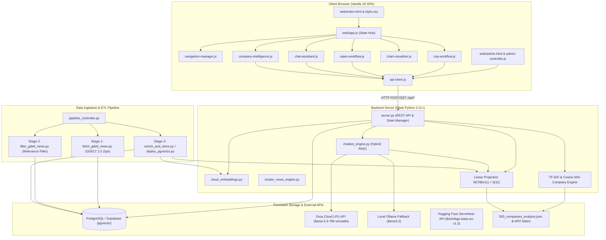
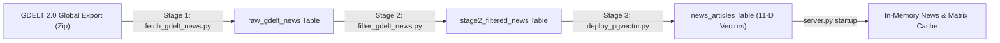
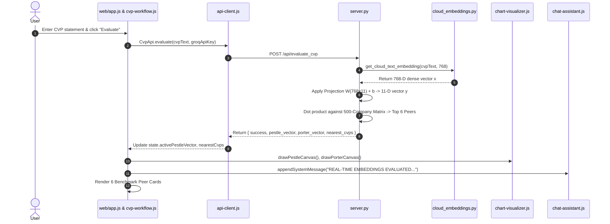
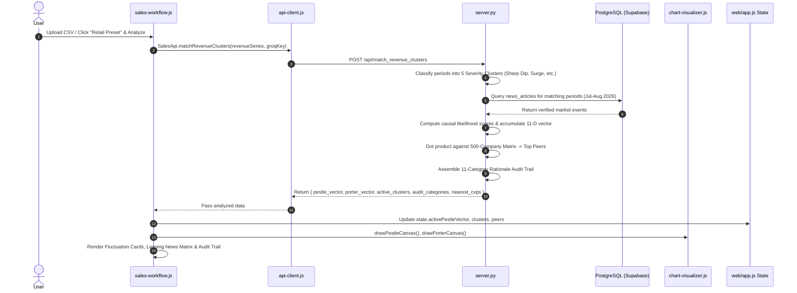
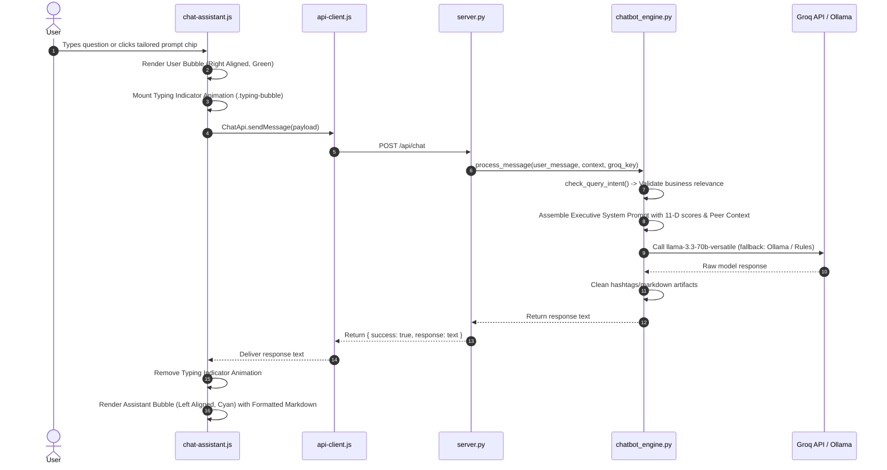

# Omniscope AI: System Architecture and Module Interaction Specification

## 1. Executive Architecture Overview

### 1.1 System Mission & Strategic Purpose
**Omniscope AI** is an explainable market intelligence and strategic decision platform. It bridges qualitative corporate strategy (Customer Value Propositions, go-to-market plans, business models) and quantitative macroeconomic market dynamics (PESTLE macro-environmental risks, Porter's 5 Forces competitive pressures, and sales/revenue time-series fluctuations).

Unlike generic large language model (LLM) wrappers, Omniscope operates on a mathematically grounded **11-Dimensional Strategic Vector Space**:
- **6 PESTLE Dimensions**: Political ($x_0$), Economic ($x_1$), Social ($x_2$), Technological ($x_3$), Legal ($x_4$), Environmental ($x_5$).
- **5 Porter's Forces Dimensions**: Threat of New Entrants ($x_6$), Bargaining Power of Buyers ($x_7$), Bargaining Power of Suppliers ($x_8$), Threat of Substitutes ($x_9$), Competitive Rivalry ($x_{10}$).

### 1.2 Architectural Topology
Omniscope employs a hybrid architecture comprising a high-performance Flask REST API backend, an in-memory linear projection and TF-IDF similarity engine, a persistent PostgreSQL vector store (Supabase with `pgvector`), an external cloud inference pipeline (Groq LPU / Hugging Face Inference API / local Ollama fallback), and a modular Vanilla JS single-page application (SPA).



---

## 2. Mathematical and Algorithmic Core

### 2.1 11-Dimensional Strategic Vector Formulation
Every market event, company profile, CVP statement, and financial fluctuation is represented as a normalized point in $[0.05, 0.95]^{11}$:
$$\mathbf{v} = [p_0, p_1, p_2, p_3, p_4, p_5, f_6, f_7, f_8, f_9, f_{10}]^T \in \mathbb{R}^{11}$$

- **$p_0 \dots p_5$ (PESTLE)**: Political, Economic, Social, Technological, Legal, Environmental.
- **$f_6 \dots f_{10}$ (Porter)**: New Entrants, Buyer Power, Supplier Power, Substitutes, Competitive Rivalry.

### 2.2 Dense-to-Strategic Linear Projection Model
Text inputs (news headlines or CVP statements) are transformed into dense semantic embeddings $\mathbf{x} \in \mathbb{R}^{768}$ via `BAAI/bge-base-en-v1.5` or `text-embedding-3-small` in `cloud_embeddings.py`.

The system projects $\mathbf{x}$ directly into the 11-D strategic space using a pre-trained linear projection matrix $\mathbf{W} \in \mathbb{R}^{768 \times 11}$ and bias vector $\mathbf{b} \in \mathbb{R}^{11}$ (trained in `train_strategic_projection.py` using Ridge regression with $\alpha = 1.0$ across 42,329 verified market event records):
$$\mathbf{y}_{\text{raw}} = \mathbf{x} \mathbf{W} + \mathbf{b}$$
$$\mathbf{y} = \text{clip}(\mathbf{y}_{\text{raw}}, 0.05, 0.95)$$

### 2.3 Hybrid Similarity & Benchmark Peer Search
To compare an active user profile against the 500 benchmark companies, the system calculates a hybrid score balancing semantic wording (384-D / TF-IDF sparse similarity) and strategic risk alignment (11-D vector cosine similarity):
$$\text{Sim}_{\text{combined}} = 0.70 \cdot \cos(\mathbf{v}_{\text{user}}, \mathbf{v}_{\text{comp}}) + 0.30 \cdot \cos(\mathbf{e}_{\text{user}}, \mathbf{e}_{\text{comp}})$$
Where:
- $\cos(\mathbf{a}, \mathbf{b}) = \frac{\mathbf{a} \cdot \mathbf{b}}{\|\mathbf{a}\|_2 \|\mathbf{b}\|_2}$
- $\mathbf{v} \in \mathbb{R}^{11}$ is the strategic vector.
- $\mathbf{e} \in \mathbb{R}^{384}$ is the text embedding vector (or TF-IDF sparse feature vector).

### 2.4 Lagging Indicator Fluctuation & Causal Likelihood Model
For sales time-series fluctuations $\Delta S \in \mathbb{R}$ (% change in quarter-over-quarter revenue) and associated market news event with impact score $I \in [0.0, 1.0]$:
1. **Severity Classification**:
   - $\Delta S \le -15\%$: Sharp Contraction (`sharp_dip`)
   - $-15\% < \Delta S \le -4\%$: Moderate Decline (`mod_dip`)
   - $-4\% < \Delta S \le +4\%$: Market Equilibrium (`flat`)
   - $+4\% < \Delta S \le +15\%$: Moderate Expansion (`mod_growth`)
   - $\Delta S > +15\%$: Rapid Expansion Surge (`high_surge`)
2. **Causal Likelihood Score ($L$)**:
   - If $|\Delta S| \le 4.0\%$: Baseline noise, $L = \text{round}(18 + |\Delta S| \cdot 2.0)$
   - If $|\Delta S| > 4.0\%$: Macro shock, $L = \min\left(96, \text{round}(I \cdot 70 + \min(30, |\Delta S|) \cdot 0.85)\right)$

---

## 3. Frontend Subsystem Specifications

All frontend modules reside in `web/` and `web/modules/`. They use pure Vanilla JavaScript (ES Modules), avoiding framework overhead.

### 3.1 `web/app.js` (Root Application Orchestrator)
- **Role**: Instantiates and connects all subsystems, holds the centralized reactive `state` object, coordinates radar redrawing, and handles global events.
- **Centralized State Schema**:
  ```javascript
  const state = {
      activeIntelligenceMode: 'cvp' | 'revenue',
      activeCvpText: string,
      activePestleVector: number[6],       // Array of 6 floats [0.05, 0.95]
      activePorterVector: number[5],       // Array of 5 floats [0.05, 0.95]
      activeUser11DVector: number[11],     // Full 11-D concatenated vector
      activeNearestCvps: Array<Object>,    // Nearest 500-company matches
      activeClusters: Array<Object>,       // Revenue fluctuation clusters
      activeOverlayPeer: Object | null,    // Peer company currently overlaid on radars
      groqApiKey: string                   // User's custom Groq API key from localStorage
  };
  ```
- **Core Methods**:
  - `syncSidebarRadars()`: Pulls active vectors and peer vectors from `state`, redraws `#sidebar-canvas-pestle` and `#sidebar-canvas-porter` via `ChartVisualizer`, updates `#sidebar-active-cvp` context text, updates sidebar numerical values, and populates `#sidebar-neighbors-list`.
  - `overlayPeerRadar(companyName)`: Fetches DB profile for peer, updates `state.activeOverlayPeer`, redraws main and sidebar dual radars with cyan dashed lines, and emits an alert in chat.

### 3.2 `web/modules/navigation-manager.js` (Multi-Screen View Router)
- **Role**: Controls transitions between 5 full-screen view panels (`#view-landing-page`, `#view-mode-selection`, `#view-step1-cvp`, `#view-step1-revenue`, `#view-step2-chatbot`).
- **Core Methods**:
  - `switchScreen(targetViewElement)`: Removes `.active` and adds `.hidden` to all view sections, activates the target view, and scrolls to top smoothly.
  - `bindEvents()`: Binds navigation buttons, logo clicks, preset chip buttons (Tata Motors, Zerodha, Retail CSV, Tech CSV), and back buttons.

### 3.3 `web/modules/cvp-workflow.js` (CVP Analysis Workflow)
- **Role**: Handles Step 1 CVP statement input, validation, API transmission, dynamic results rendering, and peer company cards.
- **Inputs**: Text from `#input-cvp-text`, API key from `state.groqApiKey`.
- **Outputs**: Dispatches payload to `CvpApi.evaluate()`, populates `#canvas-pestle`, `#canvas-porter`, and `#matches-list`.
- **Events Emitted**: `onCvpEvaluated(data)`, `onPeerRadarOverlay(companyName)`.

### 3.4 `web/modules/sales-workflow.js` (Sales & Revenue Fluctuation Workflow)
- **Role**: Manages CSV ingestion (drag-and-drop or file browser), preset data injection, client-side CSV parsing, data validation, fluctuation severity clustering, and 11-category audit trail rendering.
- **Supported CSV Schema**:
  - `period`: string (e.g., `2026-Q1`, `Jul-26`)
  - `revenue`: numeric float (e.g., `120.5`)
  - `change_pct` / `change`: numeric float (e.g., `-18.2`)
  - `notes` / `comments`: optional string
- **Core Methods**:
  - `loadPreset(type)`: Loads embedded 'retail' (Inditex/Zara baseline) or 'tech' (SaaS baseline) dataset.
  - `runAnalysis()`: Calls `SalesApi.matchRevenueClusters(parsedSeries, state.groqApiKey)`, updates `state`, and calls `renderFluctuationClusters()`, `renderLaggingNewsMatrix()`, and `renderStrategicEvidence()`.
- **Events Emitted**: `onSalesAnalyzed(data)`, `onPeerRadarOverlay(companyName)`.

### 3.5 `web/modules/chat-assistant.js` (Strategic AI Chatbot Copilot UI)
- **Role**: Manages the conversational strategy session in Step 2.
- **Visual Design**:
  - User messages: Right-aligned green bubble (`.chat-message.user .user-bubble`) with user badge.
  - Assistant messages: Left-aligned cyan bubble (`.chat-message.assistant .ai-bubble`) with robot avatar.
  - Typing indicator: Real-time animated bouncing dots (`.typing-bubble`) shown while the model generates a response.
  - System messages: Centered status card (`.system-card`) with deduplication against consecutive duplicate notices.
- **Core Methods**:
  - `sendMessage()`: Compiles active 11-D vectors, CVP statement, history, and user input; sends to `ChatApi.sendMessage()`; renders model reply.
  - `appendLoadingIndicator()` / `removeMessage(id)`: Mounts and unmounts the live typing animation.
  - `formatMarkdown(rawText)`: Converts bolding, bullet points, numbered lists, and headers into structured HTML elements.

### 3.6 `web/modules/chart-visualizer.js` (HTML5 Canvas 2D Radar Charts)
- **Role**: Pure mathematical Canvas 2D rendering of radar charts without external charting libraries.
- **Functions**:
  - `drawPestleCanvas(canvas, vector, peerVector = null)`: Draws 6-axis polygonal radar (Political, Economic, Social, Tech, Legal, Enviro). Concentric rings at 0.25, 0.50, 0.75, 1.00. User vector is filled with translucent emerald green (`rgba(0, 255, 102, 0.28)`), peer overlay is dashed electric cyan (`#00E5FF`).
  - `drawPorterCanvas(canvas, vector, peerVector = null)`: Draws 5-axis polygonal radar (New Entrants, Buyer Power, Supplier Power, Substitutes, Rivalry).
  - `updateCvpLegendValues(pestleVec, porterVec)` / `updateSalesLegendValues(pestleVec, porterVec)`: Updates numerical text elements in the DOM (`#val-p0` to `#val-p10`, `#sidebar-val-p0` to `#sidebar-val-p10`).

### 3.7 `web/modules/company-intelligence.js` (Company Profile Modal)
- **Role**: Fetches and renders verified database profiles for any of the 500 benchmark companies.
- **Core Methods**:
  - `loadAndShowProfile(companyName, userPestle, userPorter, onOverlayCallback)`: Fetches `/api/company_profile?name=...`, calculates difference between user score and company score across all 11 dimensions, and renders horizontal comparison bars.
  - `openCompanyModal(companyName, userPestle, userPorter)`: Opens `#modal-company-profile`.

### 3.8 `web/modules/api-client.js` (Centralized HTTP Client)
- **Role**: Encapsulates `fetch` operations, attaches `Authorization: Bearer <token>` headers for admin routes, serializes JSON bodies, handles 401 Unauthorized redirects, and exposes typed namespace objects (`CvpApi`, `SalesApi`, `ChatApi`, `CompanyApi`, `AdminApi`).

### 3.9 `web/modules/admin-controller.js` (Admin Pipeline & DB Controller)
- **Role**: Powers `web/admin.html`. Handles login/logout, progress polling for Stage 1, Stage 2, and Stage 3 ingestion pipelines, trigger executions, database record deletions, and live headline vector projection sandboxing.

---

## 4. Backend Subsystem Specifications

### 4.1 `server.py` (Main Flask Application)
- **Role**: Main application server. Manages route endpoints, holds in-memory cached matrices, connects to PostgreSQL / Supabase, serves static assets, and coordinates inference.
- **In-Memory Objects Loaded at Startup**:
  1. `BENCHMARK_COMPANIES_500`: List of 500 company dicts queried from `benchmark_companies` table (or loaded from `500_companies_analysis.json`).
  2. `STRATEGIC_11D_MATRIX`: Normalized NumPy matrix of shape `(500, 11)` containing 11-D vectors of all benchmark companies for sub-millisecond dot-product cosine similarity:
     $$\mathbf{S} \in \mathbb{R}^{500 \times 11}$$
  3. `TFIDF_VECTORIZER` & `TFIDF_MATRIX`: Scikit-learn TF-IDF matrix of shape `(500, 8000)` fitted on all CVP statements for lexical matching.
  4. `PROJECTION_MATRIX_W` ($768 \times 11$) & `PROJECTION_BIAS_B` ($11$): Loaded from `strategic_projection_matrix.npz` (or JSON fallback).
  5. `JULY_AUG_NEWS_CACHE`: In-memory category-indexed dictionary of July–August 2026 news articles loaded from `news_articles` table.

### 4.2 `chatbot_engine.py` (Strategic Reasoning & RAG Engine)
- **Role**: Manages contextual prompt generation, semantic retrieval, input validation, and LLM communication.
- **Key Classes**:
  - `VectorPlacementEngine`: Semantic concept anchors dictionary (`STRATEGIC_CONCEPT_ANCHORS`) covering 11 categories; keyword-based concept activation scoring; TF-IDF vector placement; nearest neighbor retrieval.
  - `GroqOllamaProvider`: Communicates with Groq API or Ollama.
    - Active Groq Models: `llama-3.3-70b-versatile`, `llama-3.1-8b-instant`, `llama-3.2-11b-vision-preview`, `llama-3.2-3b-preview`.
    - Obsolete Models Filter: Explicitly excludes deprecated models (`llama-3.1-70b-versatile`, `llama3-70b-8192`, `mixtral-8x7b-32768`, etc.).
    - Query Discriminator (`check_query_intent`): Classifies prompts into `GIBBERISH`, `OFF_TOPIC`, `GREETING`, or `BUSINESS_QUERY`. Politely declines non-business queries.
    - Rule-based Fallback Engine (`_rule_fallback_response`): Generates explainable, deterministic analysis if cloud LLMs are unreachable.
  - `BusinessEvaluator`: Formats CVP statements adhering strictly to the template:
    *“For [target customer] who [statement of need], the [product name] is a [product category] that [statement of key benefit].”*
  - `TemporalClusterMatcher`: Evaluates time-series fluctuation lists against market event clusters.
  - `ChatbotEngine`: Orchestrates retrieval, prompt construction, and response delivery.

### 4.3 `cloud_embeddings.py` (Cloud Inference Embedding Client)
- **Role**: Zero-local-GPU embedding generator.
- **Mechanism**:
  1. Primary: Hugging Face Serverless API (`https://router.huggingface.co/hf-inference/models/BAAI/bge-base-en-v1.5`).
  2. Secondary: OpenAI Embeddings API (`text-embedding-3-small`) if `OPENAI_API_KEY` is present.
  3. Tertiary: Zero-dependency deterministic hash projection yielding 768-D normalized vectors if external networks are unavailable.

### 4.4 `cluster_news_engine.py` (Strategic News Event Clustering)
- **Role**: Discovers discrete market events from raw news feeds.
- **Mechanism**: Combines 768-D semantic vectors and 11-D strategic vectors; clusters using HDBSCAN with `min_cluster_size=5` and cosine metric; calculates Silhouette and Calinski-Harabasz metrics; produces `news_clusters_summary.json`.

### 4.5 `train_strategic_projection.py` (Linear Projection Matrix Training)
- **Role**: Trains the linear projection weights $\mathbf{W} \in \mathbb{R}^{768 \times 11}$ and bias $\mathbf{b} \in \mathbb{R}^{11}$.
- **Dataset**: `enriched_news_202608.csv` (42,329 rows). 80% train, 10% validation, 10% test.
- **Output**: Saves `strategic_projection_matrix.npz` and `strategic_projection_matrix.json`.

---

## 5. Data Ingestion & ETL Pipeline Specifications

The pipeline ingests raw global news, filters it for commercial/economic relevance, maps it to the 11 strategic dimensions, and uploads it to PostgreSQL.



### 5.1 Stage 1: Ingestion (`stage1_fetcher/fetch_gdelt_zipped.py` / `fetch_gdelt_news.py`)
- **Action**: Queries GDELT 2.0 export endpoint for date ranges (e.g., `20260701` to `20260831`). Streams and unzips in memory without storing raw zip archives on disk.
- **Storage**: Inserts records into `raw_gdelt_news` table in PostgreSQL.

### 5.2 Stage 2: Filtering (`stage2_filter/filter_gdelt_news.py` / `convert.py`)
- **Action**: Reads from `raw_gdelt_news`. Applies regex and CAMEO event code filters to strip crime, celebrity, local sports, and non-economic noise.
- **Storage**: Inserts filtered articles into `stage2_filtered_news`.

### 5.3 Stage 3: Enrichment & Vector Storage (`stage3_enrich_and_store/deploy_pgvector.py`)
- **Action**: Reads from `stage2_filtered_news`. For each headline:
  1. Computes 768-D text embedding via `cloud_embeddings.py`.
  2. Multiplies by projection matrix $\mathbf{W}$ and adds bias $\mathbf{b}$ to obtain an 11-D strategic vector.
  3. Calculates strategic impact score $I$.
- **Storage**: Upserts into `news_articles` table with `vector(11)` embedding indexed via HNSW.

---

## 6. Database Schema Specifications

Implemented in PostgreSQL 15+ using the `pgvector` extension.

### 6.1 Table: `benchmark_companies`
| Column Name | Data Type | Description |
| :--- | :--- | :--- |
| `id` | `VARCHAR(255)` (PK) | Unique company identifier (slugified company name) |
| `company` | `VARCHAR(255)` | Official company name |
| `sector` | `VARCHAR(255)` | Industry sector |
| `target_customer` | `TEXT` | Target customer persona from CVP template |
| `statement_of_need` | `TEXT` | Customer pain point / need statement |
| `product_name` | `VARCHAR(255)` | Primary product or service name |
| `product_category` | `VARCHAR(255)` | Specific market category |
| `statement_of_key_benefit`| `TEXT` | Differentiating value proposition |
| `cvp` | `TEXT` | Full standard CVP statement |
| `pestle_json` | `JSONB` | Dict with keys `political`, `economic`, `social`, etc. |
| `porters_json` | `JSONB` | Dict with keys `threat_of_new_entrants`, `buyer_power`, etc. |
| `strategic_embedding_11d` | `vector(11)` | Normalized 11-D vector with HNSW index |
| `cvp_embedding_384d` | `vector(384)` | 384-D dense text embedding with HNSW index |

### 6.2 Table: `news_articles`
| Column Name | Data Type | Description |
| :--- | :--- | :--- |
| `id` | `VARCHAR(255)` (PK) | Unique article hash ID |
| `published_date` | `DATE` | Publication date (e.g., `2026-08-14`) |
| `headline` | `TEXT` | Article headline |
| `strategic_embedding_11d` | `vector(11)` | 11-D strategic score vector with HNSW index |
| `source_link` | `TEXT` | Original URL |
| `location_affected` | `VARCHAR(50)` | Affected geography (e.g., `India`, `United States`, `World`) |
| `impact_score` | `FLOAT` | Strategic significance score in $[0.0, 1.0]$ |

### 6.3 HNSW Vector Index Parameters
```sql
CREATE INDEX idx_companies_11d_hnsw ON benchmark_companies 
USING hnsw (strategic_embedding_11d vector_cosine_ops) WITH (m = 16, ef_construction = 64);

CREATE INDEX idx_news_11d_hnsw ON news_articles 
USING hnsw (strategic_embedding_11d vector_cosine_ops) WITH (m = 16, ef_construction = 64);
```

---

## 7. Exhaustive Module Interaction & Interface Contract Matrix

This section defines every interaction between each pair of modules, including exact function names, network routes, parameters, data types, and return schemas.

### 7.1 Client `cvp-workflow.js` $\leftrightarrow$ Server `server.py` (`POST /api/evaluate_cvp`)
- **Trigger**: User inputs a CVP statement and clicks "Evaluate Strategic Positioning" (`#btn-analyze-cvp`).
- **Caller**: `cvpWorkflow.analyzeCvp()` via `CvpApi.evaluate()` in `api-client.js`.
- **Callee**: `@app.route("/api/evaluate_cvp", methods=["POST"])` in `server.py`.
- **Input Payload**:
  ```json
  {
    "cvp_text": "For safety-conscious middle-class Indian families... the Nexon EV...",
    "groq_api_key": "gsk_..."
  }
  ```
- **Internal Server Logic**:
  1. Computes dense embedding $\mathbf{x} \in \mathbb{R}^{768}$ using `cloud_embeddings.py`.
  2. Projects to 11-D strategic vector using $\mathbf{W}$ and $\mathbf{b}$.
  3. Computes dot products against `STRATEGIC_11D_MATRIX` and TF-IDF matrix across all 500 benchmark companies.
  4. Ranks top 6 most similar companies and builds radar vectors.
- **Output Response**:
  ```json
  {
    "success": true,
    "cvp_text": "For safety-conscious middle-class Indian families...",
    "pestle_vector": [0.47, 0.48, 0.30, 0.30, 0.30, 0.30],
    "porter_vector": [0.30, 0.30, 0.30, 0.30, 0.30],
    "user_11d_vector": [0.47, 0.48, 0.30, 0.30, 0.30, 0.30, 0.30, 0.30, 0.30, 0.30, 0.30],
    "nearest_cvps": [
      {
        "company": "Tata Motors",
        "sector": "Automotive & Electric Mobility",
        "product_name": "Nexon EV & Bharat NCAP 5-Star SUV Range",
        "similarity": 0.942,
        "similarity_pct": 94.2,
        "cvp": "For safety-conscious middle-class Indian families...",
        "pestle_vector": [0.45, 0.50, 0.35, 0.40, 0.35, 0.35],
        "porter_vector": [0.35, 0.40, 0.35, 0.30, 0.50]
      }
    ]
  }
  ```

---

### 7.2 Client `sales-workflow.js` $\leftrightarrow$ Server `server.py` (`POST /api/match_revenue_clusters`)
- **Trigger**: User uploads a sales CSV or selects a preset and clicks "Match Revenue Fluctuation" (`#btn-analyze-revenue`).
- **Caller**: `salesWorkflow.runAnalysis()` via `SalesApi.matchRevenueClusters()` in `api-client.js`.
- **Callee**: `@app.route("/api/match_revenue_clusters", methods=["POST"])` in `server.py`.
- **Input Payload**:
  ```json
  {
    "revenue_series": [
      { "period": "2026-Q1", "revenue": 1420.5, "change_pct": 18.2, "notes": "E-Commerce expansion" },
      { "period": "2026-Q2", "revenue": 1180.0, "change_pct": -16.9, "notes": "Port supply chain friction" }
    ],
    "groq_api_key": "gsk_..."
  }
  ```
- **Internal Server Logic**:
  1. Maps each period to a fluctuation severity band (`high_surge`, `sharp_dip`, etc.).
  2. Queries verified database news items matching the period and keywords.
  3. Computes lagging causal likelihood scores for each event.
  4. Accumulates dynamic 11-D risk scores based on event weights.
  5. Computes cosine similarity against all 500 benchmark companies.
  6. Compiles empirical audit trail across all 11 PESTLE and Porter dimensions.
- **Output Response**:
  ```json
  {
    "success": true,
    "pestle_vector": [0.30, 0.47, 0.30, 0.59, 0.30, 0.30],
    "porter_vector": [0.30, 0.30, 0.45, 0.30, 0.30],
    "user_11d_vector": [0.30, 0.47, 0.30, 0.59, 0.30, 0.30, 0.30, 0.30, 0.45, 0.30, 0.30],
    "nearest_cvps": [
      {
        "company": "Inditex / Zara",
        "sector": "Retail Apparel",
        "similarity_pct": 91.2,
        "pestle_vector": [0.35, 0.45, 0.30, 0.50, 0.30, 0.30],
        "porter_vector": [0.30, 0.35, 0.40, 0.30, 0.40]
      }
    ],
    "active_clusters": [
      {
        "cluster_id": "sharp_dip",
        "cluster_name": "Sharp Contraction",
        "badge": "Severe Dip (<= -15%)",
        "severity": "danger",
        "avg_change_pct": -16.9,
        "dominant_category": "Supplier Power",
        "dominant_category_pct": 100,
        "collective_decision": "Tighten supplier SLA enforcement...",
        "items": [ ... ]
      }
    ],
    "audit_categories": {
      "pestle": [
        {
          "key": "economic",
          "name": "Economic",
          "full_name": "PESTLE: Economic Pressure",
          "assigned_score": 0.47,
          "severity_level": "Moderate Exposure",
          "dominant_fluctuation": "-16.9% (2026-Q2)",
          "dominant_likelihood": "86%",
          "overall_rationale": "Assigned score of 0.47...",
          "news_items": [ ... ]
        }
      ],
      "porter": [ ... ]
    }
  }
  ```

---

### 7.3 Client `chat-assistant.js` $\leftrightarrow$ Server `server.py` (`POST /api/chat`)
- **Trigger**: User submits a question in the Step 2 Chatbot interface.
- **Caller**: `chatAssistant.sendMessage()` via `ChatApi.sendMessage()` in `api-client.js`.
- **Callee**: `@app.route("/api/chat", methods=["POST"])` in `server.py`.
- **Input Payload**:
  ```json
  {
    "message": "What are the top PESTLE risks for my business?",
    "cvp_text": "For safety-conscious middle-class Indian families...",
    "pestle_vector": [0.47, 0.48, 0.30, 0.30, 0.30, 0.30],
    "porter_vector": [0.30, 0.30, 0.30, 0.30, 0.30],
    "user_11d_vector": [0.47, 0.48, 0.30, 0.30, 0.30, 0.30, 0.30, 0.30, 0.30, 0.30, 0.30],
    "nearest_cvps": [ { "company": "Tata Motors", "similarity_pct": 94.2 } ],
    "conversation_history": [
      { "role": "user", "content": "Hello" },
      { "role": "assistant", "content": "Hello! I am your AI Market Intelligence Assistant..." }
    ],
    "groq_api_key": "gsk_..."
  }
  ```
- **Internal Server Logic**:
  1. Invokes `ChatbotEngine.process_message()`.
  2. Runs query intent discriminator (`check_query_intent`). If greeting, gibberish, or off-topic, returns targeted guidance.
  3. Constructs executive system prompt integrating nearest benchmark peer metrics, active 11-D vector scores, and formatting rules.
  4. Dispatches prompt to Groq API (`llama-3.3-70b-versatile`) with fallback to local Ollama (`llama3.2`) and rule fallback.
- **Output Response**:
  ```json
  {
    "success": true,
    "response": "Evaluating the macro-environment for your business reveals key strategic considerations across your 11-dimensional vector space...\n\nPrimary PESTLE Risk Factors:\n- Economic Sensitivity: Consumer purchasing behavior is highly elastic...",
    "text": "Evaluating the macro-environment for your business...",
    "nearest_neighbors": [ ... ],
    "user_11d_vector": [0.47, 0.48, 0.30, 0.30, 0.30, 0.30, 0.30, 0.30, 0.30, 0.30, 0.30]
  }
  ```

---

### 7.4 Client `company-intelligence.js` $\leftrightarrow$ Server `server.py` (`GET /api/company_profile`)
- **Trigger**: User clicks "View DB Profile" or "Profile" on any company card.
- **Caller**: `CompanyIntelligence.loadAndShowProfile()` via `CompanyApi.getProfile()` in `api-client.js`.
- **Callee**: `@app.route("/api/company_profile", methods=["GET"])` in `server.py`.
- **Query Parameters**: `?name=Tata+Motors`
- **Output Response**:
  ```json
  {
    "success": true,
    "company": "Tata Motors",
    "sector": "Automotive & Electric Mobility",
    "product_name": "Nexon EV & Bharat NCAP 5-Star SUV Range",
    "product_category": "Electric & ICE Compact SUVs",
    "target_customer": "Safety-conscious middle-class Indian families and modern urban commuters",
    "statement_of_need": "Demand certified 5-star crash safety and reliable indigenous electric personal mobility",
    "statement_of_key_benefit": "Delivers certified 5-star structural crash safety, indigenous Ziptron EV powertrains, and extensive public charging ecosystem support",
    "cvp": "For safety-conscious middle-class Indian families...",
    "pestle_vector": [0.45, 0.50, 0.35, 0.40, 0.35, 0.35],
    "porter_vector": [0.35, 0.40, 0.35, 0.30, 0.50],
    "strategic_11d": [0.45, 0.50, 0.35, 0.40, 0.35, 0.35, 0.35, 0.40, 0.35, 0.30, 0.50],
    "pestle": {
      "political": "High compliance with FAME-II subsidies...",
      "economic": "Raw material battery cell import tariffs...",
      "social": "Rising middle-class consumer safety awareness...",
      "technological": "High R&D in Ziptron EV battery architecture...",
      "legal": "Strict adherence to Bharat NCAP crash norms...",
      "environmental": "Zero tailpipe emission green mobility..."
    },
    "porters": {
      "threat_of_new_entrants": "Moderate. High capital intensity...",
      "buyer_power": "Moderate to High. Significant choice in SUV segment...",
      "supplier_power": "Moderate. Reliance on global semiconductor & lithium suppliers...",
      "threat_of_substitutes": "Low. Hybrid vehicles are higher priced...",
      "competitive_rivalry": "Intense. Direct competition from Mahindra & Hyundai..."
    }
  }
  ```

---

### 7.5 Client `cvp-workflow.js` / `sales-workflow.js` $\leftrightarrow$ Client `chart-visualizer.js`
- **Trigger**: CVP analysis completes, revenue clusters are computed, peer overlay is triggered, or Step 2 screen becomes active.
- **Caller**: `cvpWorkflow.syncStateToUi()`, `salesWorkflow.runAnalysis()`, or `app.js:syncSidebarRadars()`.
- **Callee**: `ChartVisualizer.drawPestleCanvas()`, `ChartVisualizer.drawPorterCanvas()`.
- **Interface Signatures**:
  ```javascript
  ChartVisualizer.drawPestleCanvas(
      canvas: HTMLCanvasElement, 
      vector: number[6], 
      peerVector: number[6] | null = null
  ): void;

  ChartVisualizer.drawPorterCanvas(
      canvas: HTMLCanvasElement, 
      vector: number[5], 
      peerVector: number[5] | null = null
  ): void;

  ChartVisualizer.updateCvpLegendValues(
      pestleVec: number[6], 
      porterVec: number[5]
  ): void;
  ```
- **Output**: Direct 2D canvas drawing (circles, axes, labels, user green polygon, peer dashed cyan polygon) and DOM innerText updates.

---

### 7.6 Client `admin-controller.js` $\leftrightarrow$ Server `server.py` (Pipeline Endpoints)
| Method | Endpoint | Caller Method | Request Payload / Params | Response Payload |
| :--- | :--- | :--- | :--- | :--- |
| `POST` | `/api/admin/login` | `AdminApi.login()` | `{ "email": "admin@omniscope.ai", "password": "..." }` | `{ "success": true, "token": "jwt_..." }` |
| `GET` | `/api/admin/verify` | `AdminApi.verifyAuth()` | Headers: `Bearer <token>` | `{ "authenticated": true, "user": "..." }` |
| `POST` | `/api/stage1/ingest` | `AdminApi.ingestStage1()` | `{ "start_date": "2026-09-01", "end_date": "2026-09-05" }` | `{ "status": "started", "task_id": "..." }` |
| `GET` | `/api/stage1/progress`| `AdminApi.getStage1Progress()`| None | `{ "status": "processing", "progress": 64.2, "log": "..." }` |
| `POST` | `/api/stage2/process` | `AdminApi.processStage2()` | `{ "batch_size": 100, "date": "2026-09-02" }` | `{ "success": true, "processed_count": 94 }` |
| `POST` | `/api/stage3/process` | `AdminApi.processStage3()` | `{ "batch_size": 50, "date": "2026-09-02" }` | `{ "success": true, "inserted_count": 48 }` |
| `POST` | `/api/stage3/project-headline` | `AdminApi.projectHeadline()` | `{ "headline": "Govt cuts import duty on EV parts" }` | `{ "success": true, "headline": "...", "vector_11d": [0.42, ...], "scores": { "political": 0.42, ... } }` |

---

## 8. End-to-End Operational Lifecycles

### 8.1 Lifecycle 1: Customer Value Proposition (CVP) Evaluation


### 8.2 Lifecycle 2: Sales Fluctuation & Lagging Indicators Analysis


### 8.3 Lifecycle 3: Strategic AI Conversational Inference


---

## 9. Environment Variables and Deployment Specifications

### 9.1 Environment Variables Reference (`.env`)
| Variable Name | Required | Default Value | Purpose |
| :--- | :--- | :--- | :--- |
| `PORT` | No | `5000` | Local or production HTTP port |
| `SUPABASE_DB_URL` | Yes (for DB) | `""` | PostgreSQL connection string (`postgresql://postgres:[PASSWORD]@[HOST]:[PORT]/postgres`) |
| `GROQ_API_KEY` | Optional | `""` | Default API key for Groq LPU cloud inference |
| `HF_TOKEN` | Optional | `""` | Hugging Face user access token for serverless embeddings API |
| `OPENAI_API_KEY` | Optional | `""` | Fallback key for OpenAI embeddings / models |
| `ADMIN_EMAIL` | No | `admin@omniscope.ai` | Admin console login email |
| `ADMIN_PASSWORD` | No | `omniscope2026` | Admin console login password |
| `JWT_SECRET` | No | Auto-generated | Secret used to sign administrative bearer tokens |

### 9.2 Containerization & Deployment
- **Dockerfile**:
  - Base Image: `python:3.11-slim`
  - Installs: `gcc`, `libpq-dev`
  - Installs requirements: `Flask`, `Flask-Cors`, `numpy`, `scikit-learn`, `psycopg2-binary`
  - Exposes port: `5000`
  - Entrypoint: `python server.py`
- **Render (`render.yaml`)**:
  - Service Type: `web`
  - Environment: `python`
  - Build Command: `pip install -r requirements.txt`
  - Start Command: `python server.py`
  - Disk: Memory-efficient footprint (<350 MB RAM, zero PyTorch/CUDA overhead).
